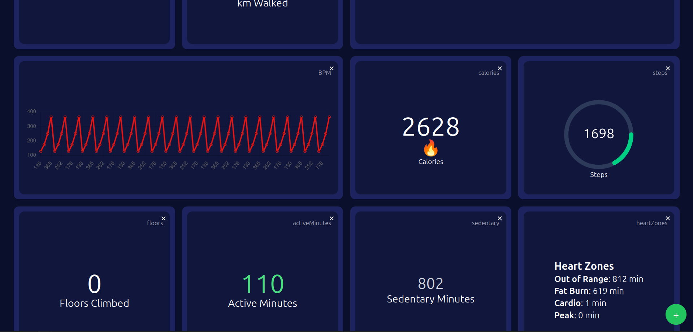

# fitviz
Fitbit web dashboard to replace the old one and provide better visualisation

Here is a draft of what it is supposed to look like in the next version... Very simple.

For now, here is the actual code rendered:

