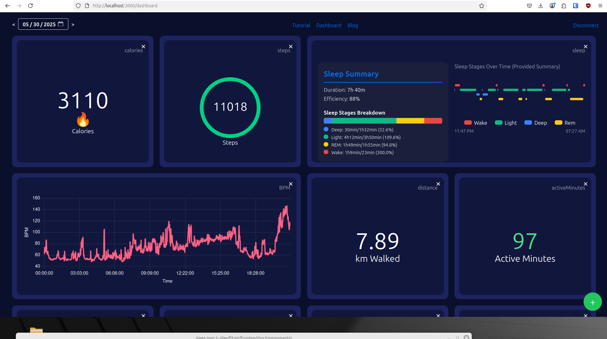
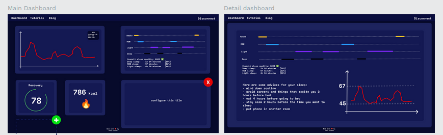

# fitviz
Fitbit web dashboard to replace the old one and provide better visualisation on desktop

Here is an overview of the web dashboard: (29/05/2025)

## About

Fitviz is a side project of mine where I developed a web dashboard to visualize my fitbit data on my computer. The original fitbit web dashboard was discontinued years ago, and people have been complaining about the new app design that isn't visually appealing and isn't easy to look at for information.

This side project has the goal of making fitbit data more readable and appealing.

## Pricing

It is FREE ! You can use it for your data no problem. I won't make it paid because I used a special api method so I don't have fees (same for hosting). So use as much as you want. I will be happy to know that people like what I built.

Also, you can share it with your friends who have fitbits :D

#### Note about the creator

I am an engineering student at ECE Paris currently working at Thales SIX in embedded systems. So I don't have a lot of time to work on this, but I will try to do the maximum in order to provide updates and bug fixes.

So do not hesitate to contact me or make a pull request :)

Have fun with your fitbit data

### draft 

here was the original penpot design file:

